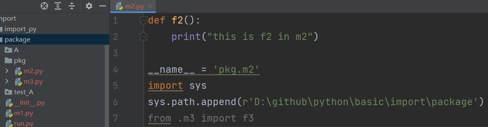
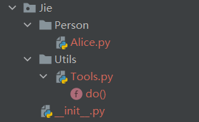

## 自定义python文件import

当前路径下的py文件和文件夹均可随意调用。若想调用上级目录的文件或位于其他位置的python文件可参考如下方式。

## 添加到系统路径

添加路径到系统路径

可添加任意一个文件路径到系统路径中，便可调用该文件下的py文件

`hi.py` 位于`D:\github\python\test`目录下，不在当前目录

```
import sys

sys.path.append(r"D:\github\python\test")
# print(sys.path)
from hi import hello

if __name__ == '__main__':
    hello()
```


## 相对引用

相对引用是根据 `__name__`，寻找py文件

如下例子不常用，只用于说明相对路径是根据`__name__`，寻找py文件。真实写代码不会修改`__name__`。



m2.py 与 m3.py，在同一目录下

设置 `__name__ = ‘pkg.xxx’`，`.`左边必须指定父文件。 


## 实用化例子

发布了一个包, 叫做`Jie`



### \__init__.py

若想调用Tools.py的`do`这个函数，外部调用代码如下，发现过于繁琐：

```
from Jie.Person.Alice import do
```


* 先在\__init__.py填入如下内容：

  * ```python
    from .Utils.Tools import do
    ```

* 再在外部调用代码如下，简化了调包:

  * ```python
    import Jie
    Jie.do()
    ```

### 包内调用其他目录的py

若想在`Person/Alice.py`文件中，调用`Utils/Tools.py`内部的函数。Alice的代码如下：

```python
from ..Utils.Tools import do
```


应在`Jie`的外部调用`Person/Alice.py`；若直接运行`Person/Alice.py`则会报错。


外部调用的代码如下：

```
from Jie.Person.Alice import do

if __name__ == '__main__':
    do()
```

当外部调用时，Alice.py的`__name__`为`Jie.Person.Alice`，那么根据`__name__`可找到上级目录`Jie.Person`，即可获得同级目录下的`Utils`。

当直接运行`Person/Alice.py`， `__name__`为`Alice`，此时无法找到上一级目录。