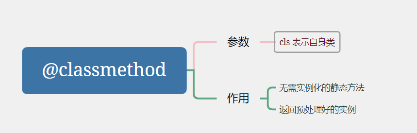

# Python基础

## 基础类型

python内置类型链接：https://docs.python.org/zh-cn/3/library/stdtypes.html

### 字典


- update([*other*])

  使用来自 *other* 的键/值对更新字典，覆盖原有的键。 返回 `None`。 [`update()`](https://docs.python.org/zh-cn/3/library/stdtypes.html#dict.update) 接受另一个字典对象，或者一个包含键/值对（以长度为二的元组或其他可迭代对象表示）的可迭代对象。 如果给出了关键字参数，则会以其所指定的键/值对更新字典: `d.update(red=1, blue=2)`。

```python
d = {'name': "J"}
cur = {
    'name': "Jie",
    'age': 10
}
d.update(cur)
print(d)

d.update(gender='male')

print(d)
```


## 函数


* map

  ```python
  def map_demo():
      a = [1, 2, 3, 4, 5]
      b = map(lambda x: x * 2, a)
      print(list(b)) #　[2, 4, 6, 8, 10]
  ```

### 修饰符

#### @classmethod

[参考：python中的@classmethod的作用.cnblog](https://blog.csdn.net/weixin_48580001/article/details/115220956)




静态方法

```python
class Student:
    normal_age = 18

    def __init__(self):
        pass

    @classmethod
    def print_info(cls):
        print('年龄：', cls.normal_age)
map_demo()
```


(工厂模型)，返回预处理后的实例化，实现不同的预处理函数来扩展类

```python
class Student:
    normal_age = 18

    def __init__(self, name, age):
        self.name = name
        self.age = age

    @classmethod
    def get_stu(cls, info):
        # 预处理输出的参数，传入构造函数
        name, age = info.split(',')
        return cls(name, age)
stu = Student.get_stu('jie, 18')
```


