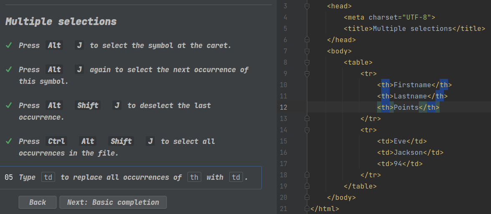
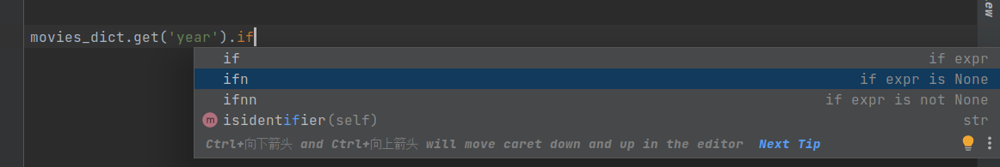
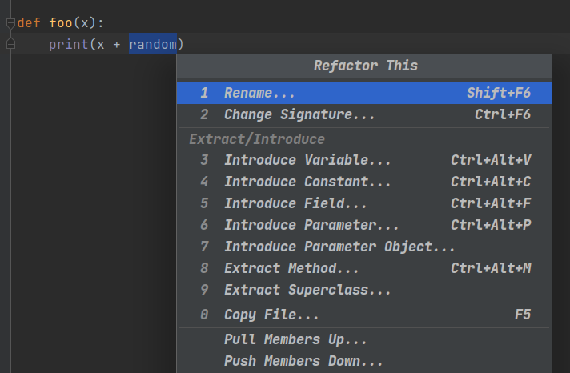
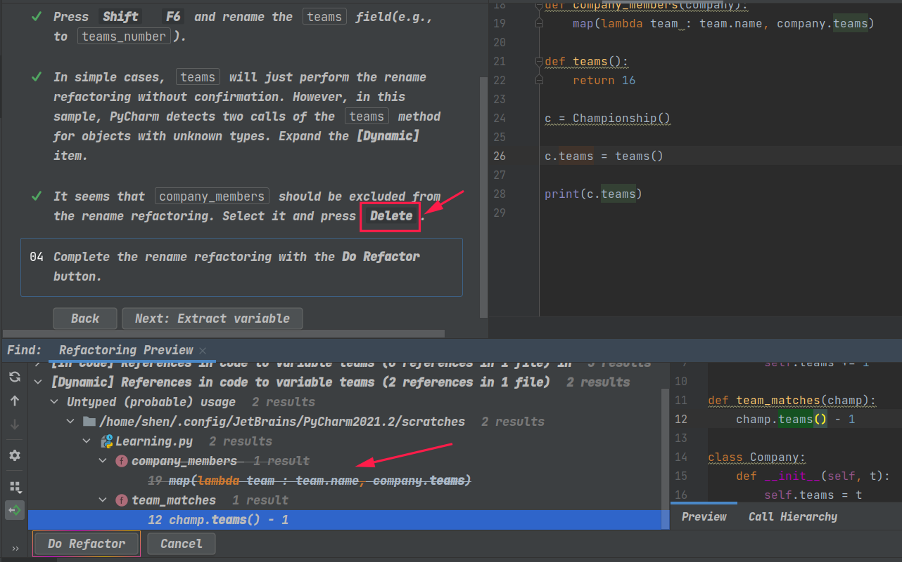
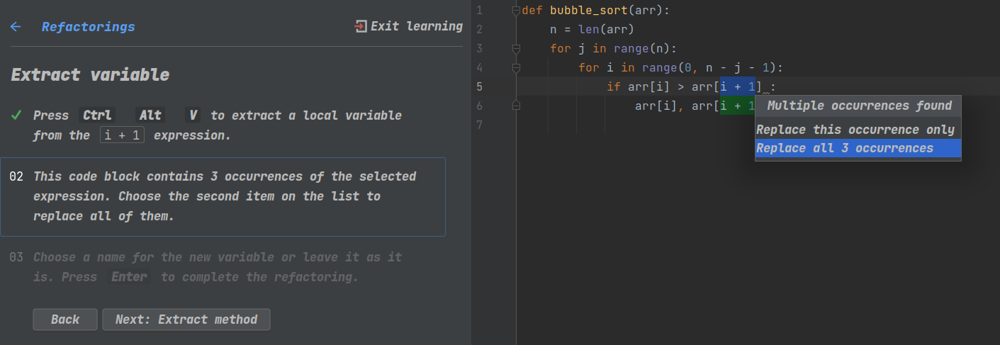
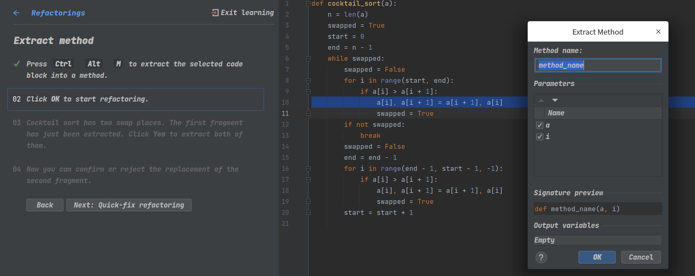
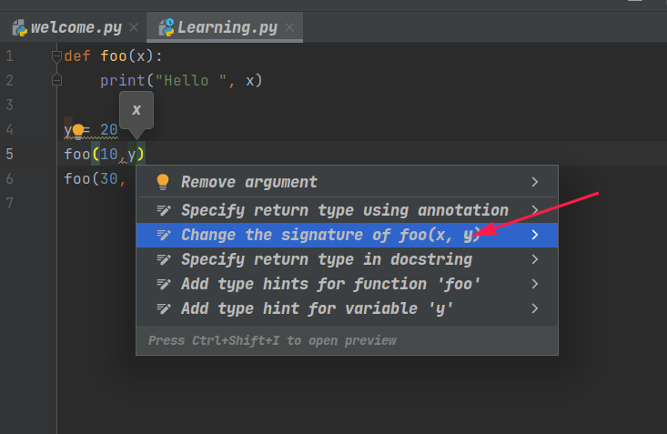

# Onboarding tour
* ==☆==`ctrl + space`: show options
  * 甚至可以提示字典的key
  * `self.total`, caret after `.`, it will show other attributes of self.
* ==☆==`ctrl shift space`: suggest completion by the context, it’s smarter than `ctrl space`.


* alt + enter: preview warnings and apply a fix
* ==☆==alt + enter: show return type in func 声明括号中
* Shift two times:  open Search Everywhere dialog

# Editor basics

# search fora actions

寻找IDE的操作 or settings。

* `ctrl + shif==☆==t + A` or `double shift`

# Editor basics

* `ctrl w`

  * first time, select the word under the caret
  * second time, select the whole string
  * third time, include quotes in the selection
  * four times, select tho whole call
  * ...
  * 选中`if`语句的整块代码

  * ```python
        if condition:
            print("Begin of the work")
            some_method("first string", "This is a long string that you can select for refactoring", "third string")
            print("End of the work")
    ```

    

* `ctrl shift w`: shrink select. oppose to `ctrl w`

* `ctrl + D`: 

* `shift + ↑`  + `ctrl + D`: 多行复制

* `ctrl + y`

  The behavior can be changed later in Settings | Keymap

  * delete current line
  * redo

* `alt + shift + ↑`: pull a line up

* `alt shift ↓`: pull down the current line.

* ==☆==`ctrl + shift ↑`: 

  * caret at method name
  * move the whole method up

* ==☆==`ctrl + shift ↓`:

  * oppose with `ctrl + shift ↑`

* ==☆==`ctrl -` collapse a code(eg: class,method)

* ==☆== `ctrl =`

* ==☆==`ctrl shift -`:collapse all regions in the file.

* ==☆==`ctrl shift =`

* ==☆==`ctrl alt t`:surround the selected code fragment  with template code. eg: try...catch.

* ==☆==`ctrl shift delete`: unwrap

# multiple selections


# Postfix 



# Refactoring menu

`ctrl alt shift T`:

* 

* ```python
  def foo(x, r=random):
      print(x + r)
  ```

  

* 

* 

  ```python
  def method_name(a, i):
      a[i], a[i + 1] = a[i + 1], a[i]
  ```

* 给method增加一个参数

  

  